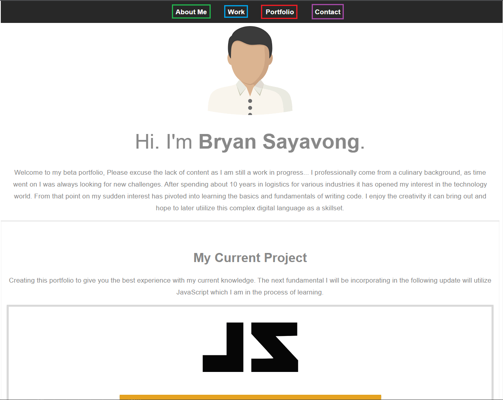

# automatic-carnival

This README.md pertains for my very first creation of my portfolio.

I've incorporated semantics & CSS to the best of my current abilty.

In this portfolio it contains a "Nav" bar which are anchored to the specific segments. When clicked it will scroll down to the section it was designated.

There are no comments left at this time for the HTML or CSS files as it was written during a developmental stage of my learning progress.

I hope you find this challenge acceptable as it was certainly a difficult one to complete. Although with practice I do feel that at this current state it can be sculpted as my studies continue.

Example link: https://bsayavong.github.io/automatic-carnival/

For demonstration you can view the webpage and in the browser and see that the links will scroll down to the corresponding sections.

